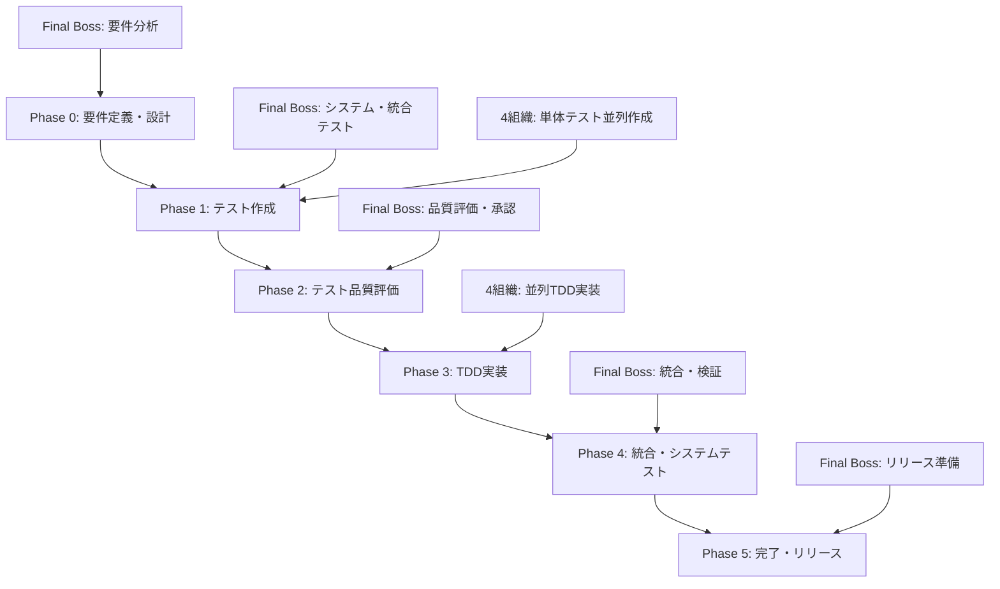

# 📐 V字モデルTDDマルチエージェント開発システム

## 🎯 システム概要

このシステムは、**V字モデルベースのTDD（テスト駆動開発）**を**マルチエージェント環境**で実現する統合開発プラットフォームです。Final Bossが全体を統括し、4つの組織（org-01〜04）が並列でテスト作成・TDD実装を行い、高品質なソフトウェアを効率的に開発します。

## 🏗️ V字モデル開発フロー



## 👥 エージェント構成

### 🏆 Final Boss (1名)
- **役割**: V字モデル全体統括・品質管理・最終判断
- **主要責任**:
  - システム・統合テスト作成
  - 4組織進捗管理・品質評価
  - 成果物統合・リリース判定
  - プロセス管理・改善指示

### 👑 Boss Agent (4名: org-01〜04)
- **役割**: 組織内3名Worker管理・品質評価・競争促進
- **主要責任**:
  - Worker単体テスト品質評価
  - TDD実装監視・比較評価
  - 最優秀実装選択・統合提案
  - Final Bossへの進捗報告

### 🔧 Worker Agent (12名: 各組織3名)
- **役割**: 専門性を活かしたテスト作成・TDD実装
- **専門分化**:
  - **Worker-A**: パフォーマンス重視実装
  - **Worker-B**: 保守性重視実装
  - **Worker-C**: 拡張性重視実装

## 🏢 4組織構成

### org-01: Core Infrastructure
```yaml
担当領域:
  - Database layer (接続管理・クエリ最適化)
  - Cache layer (Redis・メモリ効率)
  - Storage layer (S3・ファイル管理)
  - Messaging layer (非同期・イベント)
  - Monitoring layer (メトリクス・ログ)
  - Security layer (認証・暗号化)

重点品質:
  - 高可用性・信頼性
  - パフォーマンス・スケーラビリティ
  - セキュリティ・脆弱性対策
```

### org-02: Application Modules
```yaml
担当領域:
  - Competition Discovery (Kaggle API・推薦)
  - Research (論文・情報収集)
  - Code Generation (Claude Code・生成)
  - Training (GPU・モデル訓練)
  - Submission (提出・結果管理)

重点品質:
  - ビジネスロジック正確性
  - 外部API統合・エラー処理
  - アルゴリズム・計算精度
```

### org-03: Interfaces
```yaml
担当領域:
  - Web API (FastAPI・REST)
  - CLI Interface (Click・コマンド)
  - UI Components (将来・フロントエンド)

重点品質:
  - API設計・契約・互換性
  - ユーザビリティ・操作性
  - 入力検証・エラーハンドリング
```

### org-04: Quality Assurance
```yaml
担当領域:
  - Test utilities (テストヘルパー)
  - Quality metrics (品質測定)
  - Static analysis (静的解析)
  - Code review automation (自動レビュー)
  - CI/CD pipeline (自動化・デプロイ)

重点品質:
  - テスト・品質自動化
  - CI/CDパイプライン効率
  - コード品質基準維持
```

## 📋 フェーズ別詳細プロセス

### Phase 0: 要件定義・設計
```yaml
期間: 1-2日
担当: Final Boss主導

実行内容:
  - 機能要求・非機能要求明確化
  - システムアーキテクチャ設計
  - 詳細設計・API仕様定義
  - 品質基準・受入基準設定
  - 4組織への作業分担決定

成果物:
  - 要件定義書
  - システム設計書
  - 詳細設計書・API仕様
  - 品質基準書
  - 組織別作業分担表

完了条件:
  - 要件定義100%完了
  - システム設計承認取得
  - 品質基準合意達成
  - 4組織作業指示完了
```

### Phase 1: テスト作成
```yaml
期間: 3-5日
担当: Final Boss + 4組織並列

Final Boss作業:
  - システムテスト作成 (E2E・パフォーマンス・セキュリティ)
  - 統合テスト作成 (API・DB・外部連携)
  - テスト仕様書・ドキュメント作成

4組織並列作業:
  - 担当モジュール単体テスト作成
  - 3名Worker専門性活用テスト設計
  - テストカバレッジ >95% 達成
  - Boss品質評価・フィードバック対応

完了条件:
  - Final Boss: システム・統合テスト100%完成
  - 4組織: 担当単体テスト100%完成
  - 全テスト品質基準達成
  - Boss評価承認取得
```

### Phase 2: テスト品質評価・改善
```yaml
期間: 1-2日
担当: Final Boss主導

実行内容:
  - Final Boss作成テストの自己レビュー
  - 4組織単体テストの品質評価
  - テストカバレッジ分析・改善指示
  - テスト自動化・CI/CD統合確認
  - 品質基準達成確認・承認

評価基準:
  - テストカバレッジ >95%
  - テスト実行時間: 単体<10秒、統合<60秒、システム<300秒
  - 境界値・例外処理テスト網羅性
  - モック・スタブの適切な活用

完了条件:
  - システム・統合テスト品質確認完了
  - 4組織単体テスト評価・改善完了
  - 品質基準100%達成
  - Phase 3移行承認取得
```

### Phase 3: TDD実装
```yaml
期間: 5-10日
担当: 4組織並列実装 (Final Boss監視)

TDDサイクル:
  🔴 Red (失敗テスト):
    - 新機能テスト作成
    - テスト実行・失敗確認
    - 期待結果明確化
    
  🟢 Green (最小実装):
    - テスト成功最小コード実装
    - 品質無視・動作優先
    - テスト成功確認
    
  🔵 Refactor (改善):
    - 専門性活用品質向上
    - コード重複除去・設計改善
    - 全テスト成功継続確認

監視項目:
  - 12名Worker TDDサイクル進捗
  - テスト成功率・カバレッジ維持
  - 実装品質メトリクス
  - 組織内競争・協力状況

完了条件:
  - 4組織全Worker TDD実装100%完了
  - 全単体テスト100%成功維持
  - 実装品質基準達成
  - Boss最優秀実装選択完了
```

### Phase 4: 統合・システムテスト実行
```yaml
期間: 2-3日
担当: Final Boss主導

実行内容:
  - 4組織最優秀実装の統合
  - 統合テスト実行・問題解決
  - システムテスト実行・品質確認
  - パフォーマンス・セキュリティテスト実行
  - 最終品質基準達成確認

統合プロセス:
  - 各組織実装の main への統合
  - 依存関係・インターフェース確認
  - 統合時の競合・問題解決
  - 統合後の全テスト再実行

完了条件:
  - 統合テスト100%成功
  - システムテスト100%成功
  - パフォーマンス・セキュリティ基準達成
  - 品質基準100%達成
```

### Phase 5: 完了・リリース準備
```yaml
期間: 1-2日
担当: Final Boss主導

実行内容:
  - 最終品質確認・基準達成確認
  - リリース準備・デプロイメント設定
  - 運用手順書・監視設定作成
  - 次期開発計画・改善点整理
  - プロジェクト完了・成果報告

完了条件:
  - 全テスト合格確認 (100%)
  - コードカバレッジ基準達成 (>95%)
  - パフォーマンス・セキュリティ基準達成
  - ドキュメント完成度確認 (100%)
  - リリース準備100%完了
```

## 🛠️ システム運用方法

### 1. 初期セットアップ
```bash
# TDD管理環境初期化
./scripts/final_boss_tdd_manager.sh init

# Phase 0 開始
./scripts/final_boss_tdd_manager.sh start-phase phase0
```

### 2. フェーズ管理
```bash
# 各フェーズの開始
./scripts/final_boss_tdd_manager.sh start-phase phase1  # テスト作成
./scripts/final_boss_tdd_manager.sh start-phase phase2  # 品質評価
./scripts/final_boss_tdd_manager.sh start-phase phase3  # TDD実装
./scripts/final_boss_tdd_manager.sh start-phase phase4  # 統合テスト
./scripts/final_boss_tdd_manager.sh start-phase phase5  # リリース準備
```

### 3. 進捗監視・管理
```bash
# リアルタイム進捗監視
./scripts/final_boss_tdd_manager.sh monitor

# 品質評価実行
./scripts/final_boss_tdd_manager.sh evaluate

# 成果物統合
./scripts/final_boss_tdd_manager.sh integrate

# 進捗レポート生成
./scripts/final_boss_tdd_manager.sh report

# 現在状況確認
./scripts/final_boss_tdd_manager.sh status
```

### 4. 日次管理プロセス
```yaml
朝 (9:00):
  - 各組織への作業指示・計画確認
  - 前日課題・改善点の対応指示
  - 当日重点項目・目標設定

昼 (12:00):
  - 中間進捗確認・ボトルネック発見
  - リアルタイム支援・技術指導
  - 組織間協力・情報共有促進

夕 (17:00):
  - 日次総括・成果確認
  - Final Boss全体進捗報告
  - 翌日計画・優先度調整
```

## 📊 品質基準・成功指標

### テスト品質基準
```yaml
カバレッジ:
  - 単体テスト: >95%
  - 統合テスト: >90%
  - システムテスト: >85%

実行時間:
  - 単体テスト: <10秒
  - 統合テスト: <60秒
  - システムテスト: <300秒

品質メトリクス:
  - コード複雑度: <10
  - 重複コード率: <5%
  - コメント密度: >20%
```

### 実装品質基準
```yaml
専門性発揮:
  Worker-A: パフォーマンス >50%向上
  Worker-B: 保守性スコア >90%
  Worker-C: 拡張性・モジュール性最適

コード品質:
  - 可読性スコア: >80%
  - 技術債務: 最小化
  - 設計パターン適用: 適切
```

### プロジェクト成功指標
```yaml
効率性:
  - 計画通りスケジュール達成
  - 品質・スピード両立実現
  - ボトルネック早期解決

品質:
  - 全品質基準100%達成
  - バグ・欠陥率 <1%
  - ユーザー満足度 >90%

チーム成長:
  - 専門性スキル向上
  - 協力・競争文化醸成
  - 継続的学習・改善実践
```

## 📁 ファイル・ディレクトリ構造

```
kaggle_agent/
├── scripts/
│   ├── final_boss_tdd_manager.sh      # TDD管理メインスクリプト
│   ├── boss_send_message.sh           # Boss→Final Boss通信
│   ├── final_boss_watcher.sh          # Final Boss監視システム
│   └── ...
├── shared/
│   ├── tdd_implementation_checklist.md      # 統一チェックリスト
│   └── instructions/
│       ├── final_boss_tdd_instructions.md   # Final Boss指示書
│       ├── boss_tdd_instructions.md         # Boss指示書
│       └── worker_tdd_instructions.md       # Worker指示書
├── shared_main/
│   ├── tdd_progress/                   # 全体進捗追跡
│   ├── test_specifications/            # テスト仕様書
│   ├── integration_reports/            # 統合レポート
│   ├── quality_reports/                # 品質評価レポート
│   └── current_tdd_phase.txt          # 現在フェーズ
├── orgs/
│   ├── org-01/                        # Core Infrastructure
│   │   ├── shared_org01/
│   │   │   ├── tdd_task_checklist.md
│   │   │   ├── test_phase_progress/
│   │   │   ├── implementation_progress/
│   │   │   └── boss_evaluation/
│   │   ├── 01worker-a/
│   │   │   ├── unit_tests/            # 単体テスト
│   │   │   └── src/                   # TDD実装
│   │   ├── 01worker-b/
│   │   └── 01worker-c/
│   ├── org-02/                        # Application Modules
│   ├── org-03/                        # Interfaces
│   └── org-04/                        # Quality Assurance
└── tests/
    ├── e2e/                           # システムテスト
    ├── integration/                   # 統合テスト
    ├── performance/                   # パフォーマンステスト
    └── security/                      # セキュリティテスト
```

## 🔄 自律運用システム

### エージェント間通信フロー
```yaml
1. 組織内通信:
   Worker → Boss (進捗報告・問題共有)
   Boss → Worker (指示・フィードバック)

2. 組織間通信:
   Boss → Final Boss (成果報告・統合依頼)
   Final Boss → Boss (評価・次期指示)

3. 自動化プロセス:
   - 進捗監視・アラート
   - 品質評価・レポート生成
   - 成果物統合・デプロイ準備
   - 次フェーズ自動移行
```

### 継続的改善サイクル
```yaml
日次改善:
  - 進捗・品質メトリクス分析
  - ボトルネック・課題特定
  - プロセス・ツール改善
  - エージェント学習・スキル向上

週次改善:
  - 全体プロセス振り返り
  - 品質基準・目標調整
  - 組織間連携強化
  - 次期プロジェクト計画反映
```

## 🎉 期待効果・価値

### 開発効率向上
- **並列開発**: 4組織×3名=12名並列開発による高速化
- **専門性活用**: パフォーマンス・保守性・拡張性の最適バランス
- **自動化**: 進捗監視・品質評価・統合の自動化

### 品質向上
- **V字モデル**: テストファースト・品質組込み型開発
- **TDD実践**: Red-Green-Refactorによる堅牢な実装
- **多重品質確認**: Worker→Boss→Final Bossの3段階評価

### チーム成長
- **競争的協力**: 健全な競争による個人・チームスキル向上
- **専門性深化**: 分野特化による専門知識・技術の蓄積
- **継続学習**: 相互学習・改善による組織学習文化醸成

---

**V字モデルTDDマルチエージェント開発システム**により、高品質・高効率・高成長を実現する次世代開発プラットフォームを提供します。 