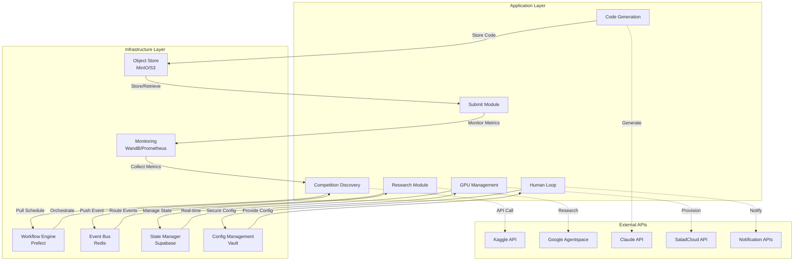
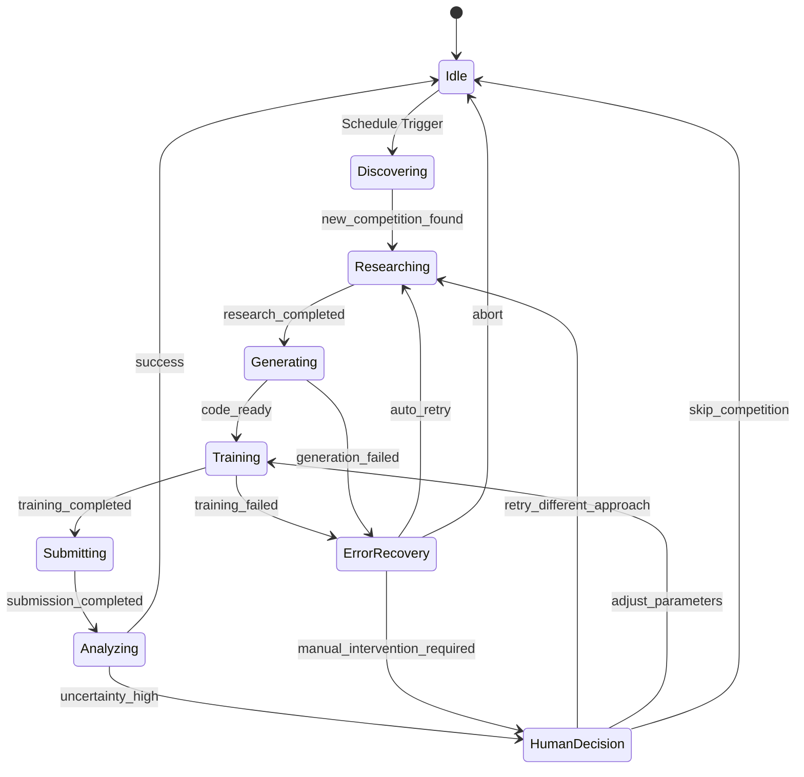

# Kaggle Agent システムアーキテクチャ設計書

**Version**: 0.1  
**Date**: 2025-06-05

## 概要

Kaggle Agent システムの技術アーキテクチャ設計。モノリシック・モジュラー設計による効率的な開発・運用と、ハイブリッド型データフローによる最適なパフォーマンスを実現。

> **📁 ディレクトリ構造**: 詳細は [`project_structure.md`](project_structure.md) を参照

## アーキテクチャ概要

### 選択したパターン
- **アーキテクチャパターン**: モノリシック・モジュラー型
- **データフローパターン**: ハイブリッド型（Pull + Push）
- **設計原理**: 開発効率、運用コスト、GPU コスト最小化を重視

### システム構成原則

```yaml
設計原則:
  開発効率最優先:
    - 単一デプロイメント単位
    - 共通ライブラリ・設定管理
    - 統一されたエラーハンドリング
  
  コスト最適化:
    - GPU使用時間最小化
    - APIコール効率化
    - リソース共有最大化
  
  保守性確保:
    - モジュール間の疎結合
    - 明確な責任境界
    - テスタブルな設計
```

## システム構成図

### アーキテクチャ全体図



## コンポーネント詳細設計

### Application Layer Modules

#### 1. Competition Discovery Module
```yaml
責任範囲:
  - Kaggle API経由でのコンペティション情報取得
  - 参加可能性評価・フィルタリング
  - データセット情報収集・キャッシュ

技術仕様:
  トリガー: スケジュール実行（1時間間隔）
  API依存: Kaggle API v1
  出力イベント: "new_competition_found"
  状態管理: competitions テーブル

主要機能:
  - コンペティション一覧取得・パース
  - 実現可能性スコア算出
  - データセットメタデータ収集
  - 参加状況トラッキング
```

#### 2. Research Module
```yaml
責任範囲:
  - Deep Research APIによる手法調査
  - アプローチ案生成・評価
  - 技術実装要件抽出

技術仕様:
  トリガー: "new_competition_found" イベント
  API依存: Google Agentspace Deep Research
  出力イベント: "research_completed"
  状態管理: research_results テーブル

主要機能:
  - 問題分析・手法探索クエリ生成
  - 複数リサーチセッション並列実行
  - 手法案ランキング・フィルタリング
  - 実装要件構造化
```

#### 3. Code Generation Module
```yaml
責任範囲:
  - Claude API による実装コード生成
  - コード品質検証・最適化
  - テストコード生成

技術仕様:
  トリガー: "research_completed" イベント
  API依存: Claude API (Anthropic)
  出力イベント: "code_ready"
  状態管理: generated_code テーブル

主要機能:
  - 手法仕様からコード生成
  - 依存関係解決・Docker化
  - 品質チェック・リント実行
  - パフォーマンステスト生成
```

#### 4. GPU Management Module
```yaml
責任範囲:
  - クラウドGPUインスタンス管理
  - 学習ジョブ実行・監視
  - コスト追跡・制限

技術仕様:
  トリガー: "code_ready" イベント + コスト監視スケジュール
  API依存: SaladCloud API, Vast.ai API
  出力イベント: "training_completed"
  状態管理: gpu_sessions, training_jobs テーブル

主要機能:
  - 最適GPU選択・プロビジョニング
  - Docker環境デプロイ・実行
  - 学習進捗監視・メトリクス収集
  - 自動終了・コスト制御
```

#### 5. Submit Module
```yaml
責任範囲:
  - 学習結果収集・検証
  - Kaggle提出ファイル準備
  - 提出実行・結果追跡

技術仕様:
  トリガー: "training_completed" イベント + スコアチェックスケジュール
  API依存: Kaggle API v1
  出力イベント: "submission_completed"
  状態管理: submissions テーブル

主要機能:
  - モデル成果物収集・検証
  - 提出形式変換・バリデーション
  - Kaggle API経由提出実行
  - スコア取得・順位追跡
```

#### 6. Human Loop Module
```yaml
責任範囲:
  - 人的判断要求・選択肢提示
  - 通知配信・応答収集
  - タイムアウト・エスカレーション管理

技術仕様:
  トリガー: "decision_required" イベント + タイムアウト監視
  API依存: Slack API, Discord API
  出力イベント: "human_decision_made"
  状態管理: human_interventions テーブル

主要機能:
  - 意思決定コンテキスト構造化
  - マルチチャンネル通知配信
  - 応答収集・検証
  - SLA管理・エスカレーション
```

### Infrastructure Layer Components

#### 1. Workflow Engine (Prefect)
```yaml
責任範囲: タスクDAG管理・実行・監視

機能詳細:
  - 非同期タスク実行・依存関係管理
  - 失敗時リトライ・復旧処理
  - 実行履歴・メトリクス管理
  - スケジュール実行

技術選択理由:
  - Python ネイティブ統合
  - 豊富なエラーハンドリング機能
  - 直感的なUI・監視機能
  - ローカル・クラウド両対応
```

#### 2. Event Bus (Redis)
```yaml
責任範囲: モジュール間非同期通信

機能詳細:
  - Pub/Sub メッセージング
  - 高速インメモリキューイング
  - イベント永続化・リプレイ
  - 分散ロック・セマフォ

技術選択理由:
  - 低レイテンシ・高スループット
  - 豊富なデータ構造サポート
  - クラスター対応・可用性
  - Python優秀なクライアントライブラリ
```

#### 3. State Manager (Supabase)
```yaml
責任範囲: 状態永続化・リアルタイム同期

機能詳細:
  - PostgreSQL ベースデータ管理
  - リアルタイム変更通知
  - 自動REST/GraphQL API生成
  - Row Level Security

技術選択理由:
  - 高い開発生産性
  - 豊富な組み込み機能
  - PostgreSQL の強力さ
  - 即座のAPI生成
```

#### 4. Object Store (MinIO/S3)
```yaml
責任範囲: 大容量データ・成果物管理

機能詳細:
  - データセット・モデル保存
  - バージョニング・ライフサイクル管理
  - 分散ストレージ・冗長化
  - S3互換API

技術選択理由:
  - 業界標準S3互換性
  - コスト効率・スケーラビリティ
  - 豊富なツールエコシステム
  - セルフホスト可能
```

#### 5. Config Management (Vault)
```yaml
責任範囲: 設定・シークレット管理

機能詳細:
  - API キー・認証情報暗号化
  - 動的シークレット生成
  - アクセス制御・監査ログ
  - 自動ローテーション

技術選択理由:
  - エンタープライズグレードセキュリティ
  - 豊富な認証バックエンド
  - 詳細なアクセス制御
  - 包括的な監査機能
```

#### 6. Monitoring (WandB + Prometheus)
```yaml
責任範囲: メトリクス収集・可視化・アラート

機能詳細:
  WandB:
    - ML実験追跡・可視化
    - ハイパーパラメータ管理
    - モデル性能比較
    - 協調フィルタリング

  Prometheus:
    - システムメトリクス収集
    - アラートルール管理
    - 時系列データベース
    - Grafana連携

技術選択理由:
  - ML特化 + システム監視の両立
  - 豊富な可視化・分析機能
  - 業界標準・豊富なエコシステム
  - スケーラブル・高可用性
```

## データフロー詳細

### ハイブリッド型データフロー設計

#### Pull-based スケジュール実行
```yaml
定期実行タスク:
  コンペティション発見:
    間隔: 1時間
    実行者: Competition Discovery
    目的: 新規コンペティション検出

  コスト監視:
    間隔: 5分
    実行者: GPU Management
    目的: 予算超過防止・リソース最適化

  スコアチェック:
    間隔: 15分
    実行者: Submit Module
    目的: リーダーボード更新確認

  タイムアウト監視:
    間隔: 1分
    実行者: Human Loop
    目的: SLA管理・エスカレーション
```

#### Push-based イベント実行
```yaml
イベントチェーン:
  new_competition_found →
    research_module.start_research()
  
  research_completed →
    code_generation.generate_implementation()
  
  code_ready →
    gpu_management.start_training()
  
  training_completed →
    submit_module.prepare_submission()
  
  submission_completed →
    [analysis_loop OR human_intervention]
  
  decision_required →
    human_loop.request_decision()
```

## 状態管理設計

### 状態遷移図



### コンペティション状態管理
```yaml
状態定義:
  discovered: 発見済み・調査待ち
  researching: 手法調査実行中
  research_completed: 調査完了・実装待ち
  code_generating: 実装コード生成中
  code_ready: 実装完了・学習待ち
  training: 学習実行中
  training_completed: 学習完了・提出待ち
  submitted: 提出完了・結果待ち
  completed: 完了
  failed: 失敗・要人的介入
  abandoned: 中断

状態遷移トリガー:
  イベントベース: モジュール完了通知
  タイムアウトベース: SLA期限超過
  手動トリガー: 人的判断・介入
```

## 非同期処理・並行性設計

### 並行実行戦略

#### 並列処理対象
```yaml
コンペティションレベル並列:
  - 複数コンペティション同時処理
  - 独立リソース・状態管理
  - 優先度ベーススケジューリング

アプローチレベル並列:
  - 同一コンペティション内複数手法
  - GPU リソース分散利用
  - 成果比較・最適選択

タスクレベル並列:
  - 研究クエリ並列実行
  - コード生成並列処理
  - 通知配信並列実行
```

#### 排他制御・リソース管理
```yaml
API レート制限:
  Kaggle API: セマフォ(3) + レート制限遵守
  Claude API: セマフォ(5) + トークン管理
  SaladCloud API: セマフォ(2) + コスト制限

GPU リソース:
  同時実行制限: 最大2インスタンス
  コスト上限: $0.15/hour × 24時間
  自動スケーリング: 需要ベース調整

データベース接続:
  接続プール: 最大20接続
  トランザクション分離: Read Committed
  デッドロック検知・復旧
```

## エラーハンドリング・回復戦略

### エラー分類・対応戦略

#### 一時的エラー (Transient Errors)
```yaml
対象エラー:
  - ネットワークタイムアウト
  - API レート制限
  - GPU リソース不足
  - 一時的サービス停止

対応戦略:
  手法: 指数バックオフリトライ
  最大試行: 3回
  基本待機時間: 1秒
  最大待機時間: 60秒
  ジッター: 0.1倍ランダム
```

#### 設定エラー (Configuration Errors)
```yaml
対象エラー:
  - 無効なAPI キー
  - 権限不足
  - 設定ファイル破損
  - 依存サービス未起動

対応戦略:
  手法: 人的介入要求
  通知: 即座にアラート配信
  フォールバック: セーフモード移行
  復旧: 手動設定修正後再開
```

#### ビジネスロジックエラー (Business Logic Errors)
```yaml
対象エラー:
  - コンペティション参加不可
  - 予算制限超過
  - 期限切れ
  - 品質基準未達

対応戦略:
  手法: スキップ・代替案実行
  ログ: 詳細原因記録
  通知: 情報提供レベル
  継続: 他タスク継続実行
```

#### システムエラー (System Errors)
```yaml
対象エラー:
  - データベース障害
  - ファイルシステム満杯
  - メモリ不足
  - プロセスクラッシュ

対応戦略:
  手法: 緊急停止・アラート
  通知: 即座のCriticalアラート
  ログ: スタックトレース・診断情報
  復旧: 手動確認後再起動
```

### 回復手順・監視

#### 自動回復機能
```yaml
ヘルスチェック:
  間隔: 30秒
  対象: 全モジュール + 依存サービス
  失敗閾値: 連続3回
  回復確認: 連続2回成功

サーキットブレーカー:
  失敗率閾値: 50%（5分間）
  半開状態: 30秒間隔で試行
  全開状態: 60秒後に半開移行

障害隔離:
  影響範囲: モジュール単位
  依存関係: 最小限のカスケード
  復旧優先度: Critical > High > Medium
```

#### 監視・アラート設定
```yaml
Critical アラート:
  - システム全体停止
  - データ損失リスク
  - セキュリティ侵害検知
  - 予算制限大幅超過

Warning アラート:
  - 個別モジュール異常
  - パフォーマンス低下
  - リソース使用率高
  - API エラー率上昇

Info 通知:
  - タスク完了
  - 新規コンペティション発見
  - 提出結果取得
  - 定期レポート
```

## 次のステップ

1. **詳細設計**: 各モジュールの内部設計・API仕様
2. **実装計画**: 開発フェーズ・スケジュール策定
3. **テスト戦略**: 単体・統合・E2Eテスト設計
4. **運用設計**: デプロイメント・監視・保守計画

---

このアーキテクチャ設計により、効率的で保守性の高いKaggle Agentシステムを構築できます。 