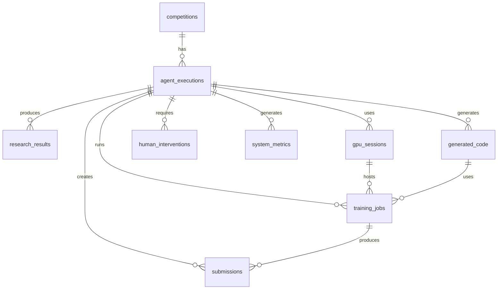

# データベーススキーマ設計

## 概要

Kaggle Agent システムのためのSupabaseデータベーススキーマ設計。アーキテクチャで定義された6つのアプリケーションモジュールの状態管理とデータフローをサポートします。

## 設計原則

1. **正規化**: 重複を最小化し、データ整合性を保証
2. **パフォーマンス**: 頻繁なクエリパターンに最適化されたインデックス
3. **スケーラビリティ**: 大量のコンペティション/実行データに対応
4. **監査性**: すべての重要な操作を追跡
5. **型安全性**: PostgreSQLの厳密な型システムを活用

## コアエンティティモデル

### 1. Competitions（コンペティション）

```sql
CREATE TABLE competitions (
    id UUID PRIMARY KEY DEFAULT gen_random_uuid(),
    kaggle_id VARCHAR(100) UNIQUE NOT NULL,
    title VARCHAR(500) NOT NULL,
    description TEXT,
    problem_type VARCHAR(50) NOT NULL, -- 'tabular', 'nlp', 'cv', 'time_series'
    dataset_size_gb DECIMAL(10,2),
    participant_count INTEGER,
    prize_pool DECIMAL(12,2),
    deadline TIMESTAMPTZ NOT NULL,
    evaluation_metric VARCHAR(100),
    submission_format TEXT,
    data_availability VARCHAR(50), -- 'public', 'private', 'restricted'
    difficulty_score DECIMAL(3,2), -- 0.0 - 1.0
    tags TEXT[], -- ARRAY of tags
    external_data_allowed BOOLEAN DEFAULT false,
    team_limit INTEGER,
    daily_submission_limit INTEGER,
    discovery_source VARCHAR(100), -- 'kaggle_api', 'manual', 'recommendation'
    created_at TIMESTAMPTZ DEFAULT NOW(),
    updated_at TIMESTAMPTZ DEFAULT NOW()
);

CREATE INDEX idx_competitions_kaggle_id ON competitions(kaggle_id);
CREATE INDEX idx_competitions_deadline ON competitions(deadline);
CREATE INDEX idx_competitions_problem_type ON competitions(problem_type);
CREATE INDEX idx_competitions_discovery_source ON competitions(discovery_source);
```

### 2. Agent Executions（エージェント実行）

```sql
CREATE TABLE agent_executions (
    id UUID PRIMARY KEY DEFAULT gen_random_uuid(),
    competition_id UUID NOT NULL REFERENCES competitions(id) ON DELETE CASCADE,
    execution_name VARCHAR(200) NOT NULL,
    status VARCHAR(50) NOT NULL DEFAULT 'pending', 
    -- 'pending', 'data_acquisition', 'research', 'code_generation', 'training', 'human_review', 'submission', 'completed', 'failed', 'cancelled'
    priority INTEGER DEFAULT 0, -- Higher = more priority
    gpu_budget_dollars DECIMAL(8,2) DEFAULT 0.15,
    gpu_budget_consumed DECIMAL(8,2) DEFAULT 0.0,
    target_submission_hours INTEGER DEFAULT 24,
    current_step INTEGER DEFAULT 1, -- 1-10 workflow steps
    error_message TEXT,
    human_intervention_required BOOLEAN DEFAULT false,
    human_intervention_reason TEXT,
    started_at TIMESTAMPTZ,
    completed_at TIMESTAMPTZ,
    created_at TIMESTAMPTZ DEFAULT NOW(),
    updated_at TIMESTAMPTZ DEFAULT NOW()
);

CREATE INDEX idx_agent_executions_competition_id ON agent_executions(competition_id);
CREATE INDEX idx_agent_executions_status ON agent_executions(status);
CREATE INDEX idx_agent_executions_priority ON agent_executions(priority DESC);
CREATE INDEX idx_agent_executions_created_at ON agent_executions(created_at);
```

### 3. Research Results（調査結果）

```sql
CREATE TABLE research_results (
    id UUID PRIMARY KEY DEFAULT gen_random_uuid(),
    execution_id UUID NOT NULL REFERENCES agent_executions(id) ON DELETE CASCADE,
    research_type VARCHAR(50) NOT NULL, -- 'academic_papers', 'kaggle_solutions', 'documentation', 'code_examples'
    query_text TEXT NOT NULL,
    source_api VARCHAR(50) NOT NULL, -- 'google_deep_research', 'arxiv', 'kaggle_api'
    raw_response JSONB NOT NULL,
    processed_insights TEXT[],
    relevance_score DECIMAL(3,2), -- 0.0 - 1.0
    citation_count INTEGER DEFAULT 0,
    research_duration_seconds INTEGER,
    tokens_consumed INTEGER,
    cost_dollars DECIMAL(8,4),
    created_at TIMESTAMPTZ DEFAULT NOW()
);

CREATE INDEX idx_research_results_execution_id ON research_results(execution_id);
CREATE INDEX idx_research_results_research_type ON research_results(research_type);
CREATE INDEX idx_research_results_relevance_score ON research_results(relevance_score DESC);
CREATE INDEX idx_research_results_source_api ON research_results(source_api);
```

### 4. Generated Code（生成コード）

```sql
CREATE TABLE generated_code (
    id UUID PRIMARY KEY DEFAULT gen_random_uuid(),
    execution_id UUID NOT NULL REFERENCES agent_executions(id) ON DELETE CASCADE,
    code_type VARCHAR(50) NOT NULL, -- 'eda', 'preprocessing', 'model', 'training', 'inference', 'submission'
    file_name VARCHAR(200) NOT NULL,
    file_path VARCHAR(500),
    code_content TEXT NOT NULL,
    programming_language VARCHAR(20) DEFAULT 'python',
    dependencies TEXT[], -- Required packages
    execution_order INTEGER, -- Order of execution in pipeline
    estimated_runtime_minutes INTEGER,
    memory_requirements_gb DECIMAL(5,2),
    gpu_required BOOLEAN DEFAULT false,
    validation_status VARCHAR(50) DEFAULT 'pending', -- 'pending', 'valid', 'invalid', 'needs_review'
    validation_errors TEXT[],
    human_approved BOOLEAN DEFAULT false,
    model_api_used VARCHAR(50), -- 'claude_code', 'custom'
    tokens_consumed INTEGER,
    cost_dollars DECIMAL(8,4),
    created_at TIMESTAMPTZ DEFAULT NOW(),
    updated_at TIMESTAMPTZ DEFAULT NOW()
);

CREATE INDEX idx_generated_code_execution_id ON generated_code(execution_id);
CREATE INDEX idx_generated_code_code_type ON generated_code(code_type);
CREATE INDEX idx_generated_code_execution_order ON generated_code(execution_order);
CREATE INDEX idx_generated_code_validation_status ON generated_code(validation_status);
```

### 5. GPU Sessions（GPU セッション）

```sql
CREATE TABLE gpu_sessions (
    id UUID PRIMARY KEY DEFAULT gen_random_uuid(),
    execution_id UUID NOT NULL REFERENCES agent_executions(id) ON DELETE CASCADE,
    provider VARCHAR(50) NOT NULL, -- 'salad_cloud', 'vast_ai', 'lambda_labs'
    instance_id VARCHAR(200), -- Provider's instance ID
    instance_type VARCHAR(100) NOT NULL, -- e.g., 'RTX4090', 'A100'
    gpu_count INTEGER DEFAULT 1,
    memory_gb INTEGER,
    storage_gb INTEGER,
    hourly_rate_dollars DECIMAL(6,4),
    region VARCHAR(50),
    status VARCHAR(50) NOT NULL DEFAULT 'provisioning',
    -- 'provisioning', 'running', 'idle', 'terminated', 'failed'
    provisioned_at TIMESTAMPTZ,
    terminated_at TIMESTAMPTZ,
    total_runtime_minutes INTEGER DEFAULT 0,
    total_cost_dollars DECIMAL(8,4) DEFAULT 0.0,
    cost_limit_dollars DECIMAL(8,4),
    auto_terminate_at TIMESTAMPTZ,
    ssh_connection_info JSONB, -- Encrypted connection details
    error_message TEXT,
    created_at TIMESTAMPTZ DEFAULT NOW(),
    updated_at TIMESTAMPTZ DEFAULT NOW()
);

CREATE INDEX idx_gpu_sessions_execution_id ON gpu_sessions(execution_id);
CREATE INDEX idx_gpu_sessions_provider ON gpu_sessions(provider);
CREATE INDEX idx_gpu_sessions_status ON gpu_sessions(status);
CREATE INDEX idx_gpu_sessions_auto_terminate_at ON gpu_sessions(auto_terminate_at);
```

### 6. Training Jobs（訓練ジョブ）

```sql
CREATE TABLE training_jobs (
    id UUID PRIMARY KEY DEFAULT gen_random_uuid(),
    execution_id UUID NOT NULL REFERENCES agent_executions(id) ON DELETE CASCADE,
    gpu_session_id UUID REFERENCES gpu_sessions(id) ON DELETE SET NULL,
    code_id UUID NOT NULL REFERENCES generated_code(id) ON DELETE CASCADE,
    job_name VARCHAR(200) NOT NULL,
    model_type VARCHAR(100), -- 'xgboost', 'lightgbm', 'neural_network', 'transformer'
    hyperparameters JSONB,
    dataset_split JSONB, -- train/val/test split configuration
    status VARCHAR(50) NOT NULL DEFAULT 'queued',
    -- 'queued', 'running', 'completed', 'failed', 'cancelled'
    started_at TIMESTAMPTZ,
    completed_at TIMESTAMPTZ,
    runtime_minutes INTEGER,
    peak_memory_gb DECIMAL(6,2),
    gpu_utilization_percent DECIMAL(5,2),
    best_validation_score DECIMAL(10,6),
    final_test_score DECIMAL(10,6),
    model_artifacts_path VARCHAR(500), -- S3/MinIO path
    logs_path VARCHAR(500),
    metrics JSONB, -- Training metrics history
    early_stopping_epoch INTEGER,
    total_epochs INTEGER,
    error_message TEXT,
    created_at TIMESTAMPTZ DEFAULT NOW(),
    updated_at TIMESTAMPTZ DEFAULT NOW()
);

CREATE INDEX idx_training_jobs_execution_id ON training_jobs(execution_id);
CREATE INDEX idx_training_jobs_gpu_session_id ON training_jobs(gpu_session_id);
CREATE INDEX idx_training_jobs_status ON training_jobs(status);
CREATE INDEX idx_training_jobs_best_validation_score ON training_jobs(best_validation_score DESC);
```

### 7. Submissions（提出）

```sql
CREATE TABLE submissions (
    id UUID PRIMARY KEY DEFAULT gen_random_uuid(),
    execution_id UUID NOT NULL REFERENCES agent_executions(id) ON DELETE CASCADE,
    training_job_id UUID REFERENCES training_jobs(id) ON DELETE SET NULL,
    submission_file_path VARCHAR(500) NOT NULL,
    description TEXT,
    kaggle_submission_id VARCHAR(100),
    public_score DECIMAL(10,6),
    private_score DECIMAL(10,6),
    public_rank INTEGER,
    private_rank INTEGER,
    total_participants INTEGER,
    submission_status VARCHAR(50) DEFAULT 'pending',
    -- 'pending', 'submitted', 'scored', 'failed', 'disqualified'
    submitted_at TIMESTAMPTZ,
    scored_at TIMESTAMPTZ,
    error_message TEXT,
    created_at TIMESTAMPTZ DEFAULT NOW(),
    updated_at TIMESTAMPTZ DEFAULT NOW()
);

CREATE INDEX idx_submissions_execution_id ON submissions(execution_id);
CREATE INDEX idx_submissions_public_score ON submissions(public_score DESC);
CREATE INDEX idx_submissions_submission_status ON submissions(submission_status);
CREATE INDEX idx_submissions_submitted_at ON submissions(submitted_at);
```

### 8. Human Interventions（人的介入）

```sql
CREATE TABLE human_interventions (
    id UUID PRIMARY KEY DEFAULT gen_random_uuid(),
    execution_id UUID NOT NULL REFERENCES agent_executions(id) ON DELETE CASCADE,
    intervention_type VARCHAR(50) NOT NULL,
    -- 'approval_required', 'error_review', 'strategy_change', 'manual_override'
    priority VARCHAR(20) DEFAULT 'medium', -- 'low', 'medium', 'high', 'critical'
    status VARCHAR(50) DEFAULT 'pending', -- 'pending', 'reviewed', 'approved', 'rejected', 'escalated'
    title VARCHAR(200) NOT NULL,
    description TEXT NOT NULL,
    context_data JSONB, -- Relevant data for decision making
    assigned_to VARCHAR(100), -- User email/ID
    response TEXT,
    response_data JSONB, -- Structured response from human
    notification_sent BOOLEAN DEFAULT false,
    notification_method VARCHAR(50), -- 'slack', 'discord', 'email'
    escalation_count INTEGER DEFAULT 0,
    sla_deadline TIMESTAMPTZ, -- When response is needed by
    created_at TIMESTAMPTZ DEFAULT NOW(),
    responded_at TIMESTAMPTZ,
    updated_at TIMESTAMPTZ DEFAULT NOW()
);

CREATE INDEX idx_human_interventions_execution_id ON human_interventions(execution_id);
CREATE INDEX idx_human_interventions_status ON human_interventions(status);
CREATE INDEX idx_human_interventions_priority ON human_interventions(priority);
CREATE INDEX idx_human_interventions_sla_deadline ON human_interventions(sla_deadline);
```

### 9. System Metrics（システムメトリクス）

```sql
CREATE TABLE system_metrics (
    id UUID PRIMARY KEY DEFAULT gen_random_uuid(),
    metric_name VARCHAR(100) NOT NULL,
    metric_value DECIMAL(15,6) NOT NULL,
    metric_type VARCHAR(50) NOT NULL, -- 'counter', 'gauge', 'histogram'
    tags JSONB, -- Key-value pairs for grouping
    execution_id UUID REFERENCES agent_executions(id) ON DELETE SET NULL,
    component VARCHAR(50), -- 'competition_discovery', 'research', 'code_generation', etc.
    timestamp TIMESTAMPTZ DEFAULT NOW()
);

CREATE INDEX idx_system_metrics_metric_name ON system_metrics(metric_name);
CREATE INDEX idx_system_metrics_timestamp ON system_metrics(timestamp);
CREATE INDEX idx_system_metrics_execution_id ON system_metrics(execution_id);
CREATE INDEX idx_system_metrics_component ON system_metrics(component);
```

### 10. Configuration（設定）

```sql
CREATE TABLE configurations (
    id UUID PRIMARY KEY DEFAULT gen_random_uuid(),
    config_key VARCHAR(200) UNIQUE NOT NULL,
    config_value JSONB NOT NULL,
    config_type VARCHAR(50) NOT NULL, -- 'system', 'api', 'gpu', 'model', 'notification'
    description TEXT,
    is_encrypted BOOLEAN DEFAULT false,
    is_sensitive BOOLEAN DEFAULT false,
    created_at TIMESTAMPTZ DEFAULT NOW(),
    updated_at TIMESTAMPTZ DEFAULT NOW()
);

CREATE INDEX idx_configurations_config_key ON configurations(config_key);
CREATE INDEX idx_configurations_config_type ON configurations(config_type);
```

## リレーションシップダイアグラム



## データアクセスパターン

### 1. 読み取り集約クエリ

最も頻繁なクエリパターンに対する最適化:

#### コンペティション発見ダッシュボード
```sql
-- Active competitions with execution statistics
SELECT 
    c.*,
    COUNT(ae.id) as execution_count,
    MAX(ae.created_at) as last_execution,
    AVG(s.public_score) as avg_score
FROM competitions c
LEFT JOIN agent_executions ae ON c.id = ae.competition_id
LEFT JOIN submissions s ON ae.id = s.execution_id
WHERE c.deadline > NOW()
GROUP BY c.id
ORDER BY c.deadline ASC;
```

#### 実行進捗追跡
```sql
-- Execution progress with current step details
SELECT 
    ae.*,
    c.title as competition_title,
    c.deadline,
    gs.status as gpu_status,
    gs.total_cost_dollars as gpu_cost,
    COUNT(hi.id) as pending_interventions
FROM agent_executions ae
JOIN competitions c ON ae.competition_id = c.id
LEFT JOIN gpu_sessions gs ON ae.id = gs.execution_id AND gs.status IN ('running', 'idle')
LEFT JOIN human_interventions hi ON ae.id = hi.execution_id AND hi.status = 'pending'
WHERE ae.status NOT IN ('completed', 'failed', 'cancelled')
GROUP BY ae.id, c.id, gs.id;
```

### 2. 書き込みパターン

#### バッチ研究結果挿入
```sql
-- Bulk research results insertion with conflict handling
INSERT INTO research_results (
    execution_id, research_type, query_text, source_api, 
    raw_response, processed_insights, relevance_score, cost_dollars
) VALUES ... 
ON CONFLICT DO NOTHING;
```

#### メトリクス時系列挿入
```sql
-- High-frequency metrics insertion
INSERT INTO system_metrics (metric_name, metric_value, metric_type, tags, execution_id, component)
SELECT * FROM unnest($1::metric_row[]);
```

## パフォーマンス最適化

### 1. パーティショニング戦略

```sql
-- Time-based partitioning for high-volume tables
CREATE TABLE system_metrics (
    -- ... columns ...
) PARTITION BY RANGE (timestamp);

CREATE TABLE system_metrics_2024_01 PARTITION OF system_metrics
    FOR VALUES FROM ('2024-01-01') TO ('2024-02-01');
```

### 2. マテリアライズドビュー

```sql
-- Execution summary materialized view
CREATE MATERIALIZED VIEW execution_summary AS
SELECT 
    ae.id,
    ae.competition_id,
    ae.status,
    ae.gpu_budget_consumed,
    COUNT(DISTINCT rr.id) as research_count,
    COUNT(DISTINCT gc.id) as code_files_count,
    COUNT(DISTINCT tj.id) as training_jobs_count,
    COUNT(DISTINCT s.id) as submissions_count,
    MAX(s.public_score) as best_score,
    ae.created_at,
    ae.updated_at
FROM agent_executions ae
LEFT JOIN research_results rr ON ae.id = rr.execution_id
LEFT JOIN generated_code gc ON ae.id = gc.execution_id
LEFT JOIN training_jobs tj ON ae.id = tj.execution_id
LEFT JOIN submissions s ON ae.id = s.execution_id
GROUP BY ae.id;

CREATE UNIQUE INDEX idx_execution_summary_id ON execution_summary(id);
```

## データ保持ポリシー

### 1. 自動クリーンアップ

```sql
-- Clean up old system metrics (keep 90 days)
DELETE FROM system_metrics 
WHERE timestamp < NOW() - INTERVAL '90 days';

-- Archive completed executions (keep 1 year)
DELETE FROM agent_executions 
WHERE status IN ('completed', 'failed') 
AND completed_at < NOW() - INTERVAL '1 year';
```

### 2. バックアップ戦略

- **フル日次バックアップ**: すべてのテーブル
- **増分時間別バックアップ**: メトリクスとログテーブル
- **ポイントインタイム復旧**: 24時間のWAL保持

## セキュリティ考慮事項

### 1. Row Level Security (RLS)

```sql
-- Enable RLS on sensitive tables
ALTER TABLE configurations ENABLE ROW LEVEL SECURITY;

-- Policy for configuration access
CREATE POLICY config_access_policy ON configurations
    FOR ALL TO authenticated
    USING (NOT is_sensitive OR auth.role() = 'admin');
```

### 2. 暗号化

```sql
-- Encrypt sensitive configuration values
CREATE OR REPLACE FUNCTION encrypt_config_value(value TEXT)
RETURNS TEXT AS $$
BEGIN
    RETURN pgp_sym_encrypt(value, current_setting('app.encryption_key'));
END;
$$ LANGUAGE plpgsql;
```

## 型定義とバリデーション

### 1. カスタムドメイン型

```sql
-- Custom domain types for validation
CREATE DOMAIN email AS TEXT 
CHECK (VALUE ~ '^[A-Za-z0-9._%+-]+@[A-Za-z0-9.-]+\.[A-Za-z]{2,}$');

CREATE DOMAIN percentage AS DECIMAL(5,2)
CHECK (VALUE >= 0 AND VALUE <= 100);

CREATE DOMAIN positive_decimal AS DECIMAL(15,6)
CHECK (VALUE >= 0);
```

### 2. JSON スキーマバリデーション

```sql
-- JSON schema validation functions
CREATE OR REPLACE FUNCTION validate_hyperparameters(params JSONB)
RETURNS BOOLEAN AS $$
BEGIN
    -- Validate required fields and types
    RETURN (
        params ? 'learning_rate' AND 
        (params->>'learning_rate')::DECIMAL > 0 AND
        params ? 'epochs' AND
        (params->>'epochs')::INTEGER > 0
    );
END;
$$ LANGUAGE plpgsql;

ALTER TABLE training_jobs 
ADD CONSTRAINT valid_hyperparameters 
CHECK (validate_hyperparameters(hyperparameters));
```

## 移行戦略

### 1. 段階的移行

1. **フェーズ1**: コアテーブル（competitions, agent_executions）
2. **フェーズ2**: 研究とコード生成テーブル
3. **フェーズ3**: GPU とトレーニングテーブル
4. **フェーズ4**: メトリクスと設定テーブル

### 2. 移行検証

```sql
-- Data integrity checks
SELECT 
    'agent_executions' as table_name,
    COUNT(*) as row_count,
    COUNT(DISTINCT competition_id) as unique_competitions,
    MIN(created_at) as earliest_record,
    MAX(created_at) as latest_record
FROM agent_executions
UNION ALL
SELECT 
    'training_jobs',
    COUNT(*),
    COUNT(DISTINCT execution_id),
    MIN(created_at),
    MAX(created_at)
FROM training_jobs;
```

このデータベーススキーマは、Kaggle Agent システムの全ライフサイクルをサポートし、高パフォーマンス、スケーラビリティ、および保守性を提供します。 