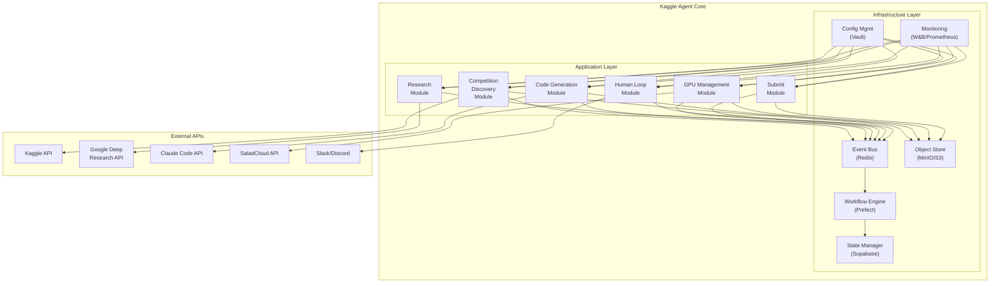
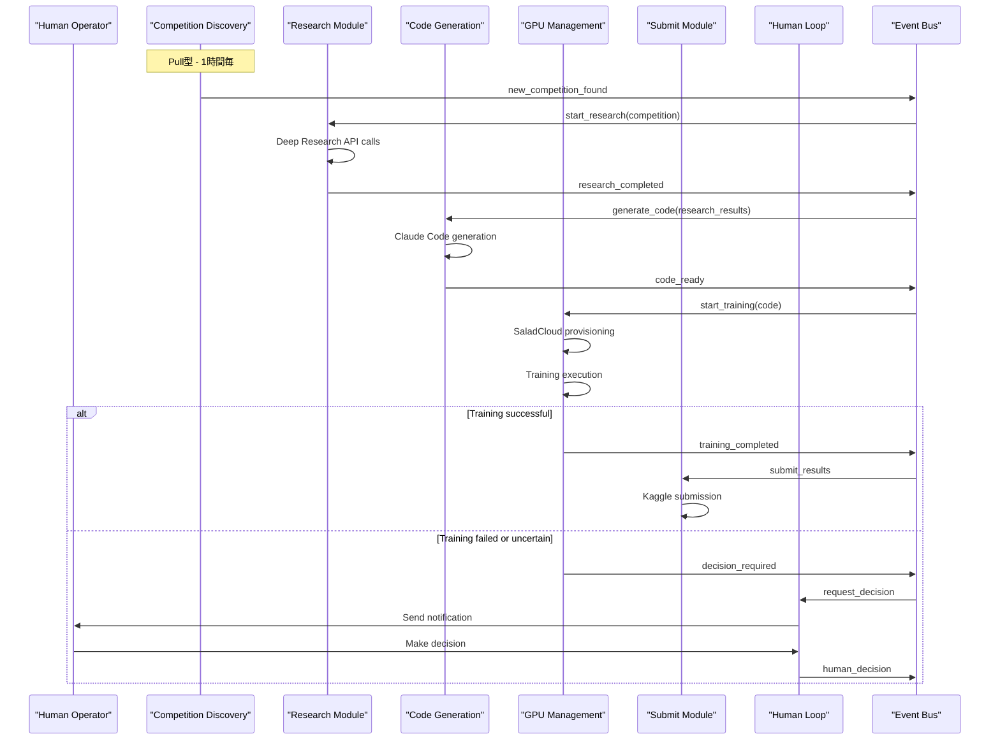
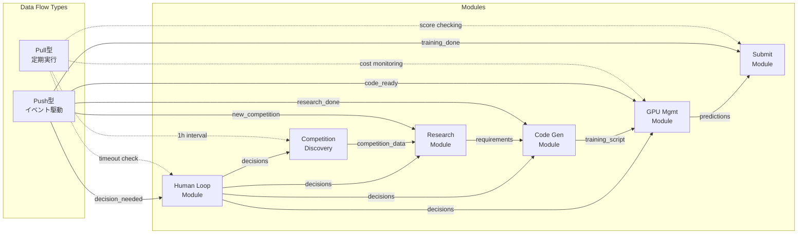

# Kaggle エージェント システムアーキテクチャ詳細設計

*バージョン 0.1 — 2025-06-05*

---

## 目次
1. [アーキテクチャ概要](#1-アーキテクチャ概要)
2. [システム構成図](#2-システム構成図)
3. [コンポーネント詳細設計](#3-コンポーネント詳細設計)
4. [データフロー詳細](#4-データフロー詳細)
5. [状態管理設計](#5-状態管理設計)
6. [非同期処理・並行性設計](#6-非同期処理・並行性設計)
7. [エラーハンドリング・回復戦略](#7-エラーハンドリング・回復戦略)
8. [次のステップ](#8-次のステップ)

---

## 1. アーキテクチャ概要

### 1.1 選択したパターン
- **アーキテクチャ**: モノリシック・モジュラー型
- **データフロー**: ハイブリッド型（Pull + Push）
- **理由**: 開発効率、運用コスト、GPU コスト最小化を重視

### 1.2 システム構成（構造化定義）

```yaml
kaggle_agent:
  architecture_type: "monolithic_modular"
  data_flow_type: "hybrid_pull_push"
  
  layers:
    application:
      modules:
        - name: "competition_discovery"
          responsibility: "コンペ発見・データ取得"
          data_flow: ["pull_hourly", "push_manual"]
          external_apis: ["kaggle_api"]
          
        - name: "research_module"
          responsibility: "手法調査・アイデア創出"
          data_flow: ["push_competition_found", "pull_additional_research"]
          external_apis: ["deep_research_api"]
          
        - name: "code_generation"
          responsibility: "実装コード生成"
          data_flow: ["push_research_done", "pull_code_improvement"]
          external_apis: ["claude_code_api"]
          
        - name: "gpu_management"
          responsibility: "GPU リソース管理・学習実行"
          data_flow: ["push_code_ready", "pull_cost_monitoring"]
          external_apis: ["saladcloud_api"]
          
        - name: "submit_module"
          responsibility: "提出・スコア取得"
          data_flow: ["push_training_done", "pull_score_check"]
          external_apis: ["kaggle_api"]
          
        - name: "human_loop"
          responsibility: "人間判断・通知"
          data_flow: ["push_decision_needed", "pull_timeout_check"]
          external_apis: ["slack_api", "discord_api"]
    
    infrastructure:
      components:
        - name: "workflow_engine"
          technology: "prefect"
          responsibility: "タスクDAG管理・実行"
          
        - name: "event_bus"
          technology: "redis"
          responsibility: "モジュール間イベント通信"
          
        - name: "state_manager"
          technology: "supabase"
          responsibility: "永続化状態管理・リアルタイム・API生成"
          
        - name: "object_store"
          technology: "minio_s3"
          responsibility: "データセット・成果物保存"
          
        - name: "config_management"
          technology: "vault"
          responsibility: "設定・シークレット管理"
          
        - name: "monitoring"
          technology: "wandb_prometheus"
          responsibility: "メトリクス・ログ管理"

  data_flows:
    pull_based:
      - source: "scheduler"
        target: "competition_discovery"
        interval: "1h"
        description: "新コンペ発見"
        
      - source: "scheduler"
        target: "gpu_management"
        interval: "5m"
        description: "コスト監視"
        
      - source: "scheduler"
        target: "submit_module"
        interval: "15m"
        description: "スコアチェック"
        
      - source: "scheduler"
        target: "human_loop"
        interval: "1m"
        description: "タイムアウト監視"
    
    push_based:
      - source: "competition_discovery"
        target: "research_module"
        event: "new_competition_found"
        
      - source: "research_module"
        target: "code_generation"
        event: "research_completed"
        
      - source: "code_generation"
        target: "gpu_management"
        event: "code_ready"
        
      - source: "gpu_management"
        target: "submit_module"
        event: "training_completed"
        
      - source: "*"
        target: "human_loop"
        event: "decision_required"

  state_transitions:
    workflow_states:
      - "idle"
      - "discovering_competitions"
      - "researching_approaches"
      - "generating_code"
      - "training_models"
      - "submitting_results"
      - "waiting_human_decision"
      - "error_recovery"
    
    competition_states:
      - "discovered"
      - "research_completed"
      - "code_generated"
      - "training_in_progress"
      - "training_completed"
      - "submitted"
      - "completed"
    
    resource_states:
      - "available"
      - "provisioning"
      - "running"
      - "terminating"
      - "error"

  error_handling:
    error_types:
      transient:
        examples: ["api_rate_limit", "network_timeout", "gpu_unavailable"]
        strategy: "exponential_backoff_retry"
        max_attempts: 3
        
      configuration:
        examples: ["invalid_api_token", "invalid_config", "permission_denied"]
        strategy: "human_intervention_required"
        
      business_logic:
        examples: ["competition_ineligible", "budget_exceeded", "deadline_passed"]
        strategy: "skip_and_continue"

  concurrency:
    parallel_tasks:
      - "multiple_competition_research"
      - "multiple_approach_implementation"
      - "parallel_gpu_management"
      - "concurrent_notifications"
    
    exclusive_resources:
      - resource: "saladcloud_api"
        limit: "rate_limited"
        semaphore: 5
        
      - resource: "kaggle_api"
        limit: "rate_limited"
        semaphore: 3
        
      - resource: "gpu_instances"
        limit: "cost_constrained"
        semaphore: 2
```

## 2. システム構成図

### 2.1 全体アーキテクチャ図



### 2.2 データフロー図



### 2.3 データフロータイプ図



## 3. コンポーネント詳細設計

### 3.1 Competition Discovery Module

**責務**: Kaggle コンペティションの発見・メタデータ取得・データダウンロード

**主要クラス**:
```python
class CompetitionDiscovery:
    def discover_competitions() -> List[Competition]
    def get_competition_metadata(comp_id: str) -> CompetitionMetadata
    def download_dataset(comp_id: str) -> DatasetInfo
    def validate_competition_eligibility(comp: Competition) -> bool
```

**データフロー**:
- **Pull型**: 1時間ごとに新しいコンペをポーリング
- **Push型**: ユーザーが手動でコンペを指定した場合

### 3.2 Research Module

**責務**: Google Deep Research API を活用した手法調査・アイデア創出

**主要クラス**:
```python
class ResearchModule:
    def generate_research_queries(comp: Competition) -> List[str]
    def execute_deep_research(queries: List[str]) -> List[ResearchResult]
    def rank_approaches(results: List[ResearchResult]) -> List[RankedApproach]
    def synthesize_requirements(approach: RankedApproach) -> RequirementSpec
```

**データフロー**:
- **Push型**: Competition Discovery から新しいコンペが通知された場合
- **Pull型**: 既存コンペの追加調査（定期実行）

### 3.3 Code Generation Module

**責務**: Claude Code を活用した実装コード生成・学習スクリプト作成

**主要クラス**:
```python
class CodeGenerationModule:
    def generate_baseline_code(spec: RequirementSpec) -> CodeBundle
    def generate_training_script(spec: RequirementSpec) -> TrainingScript
    def optimize_hyperparameters(model: ModelConfig) -> HyperParams
    def create_docker_image(code: CodeBundle) -> DockerImage
```

**データフロー**:
- **Push型**: Research Module から要件仕様が完成した場合
- **Pull型**: 既存コードの改善・リファクタリング

### 3.4 GPU Management Module

**責務**: SaladCloud GPU リソースの管理・ジョブ実行・コスト最適化

**主要クラス**:
```python
class GPUManager:
    def select_optimal_gpu(requirements: HardwareRequirements) -> GPUSpec
    def provision_instance(gpu_spec: GPUSpec) -> GPUInstance
    def execute_training_job(script: TrainingScript, instance: GPUInstance) -> Job
    def monitor_costs(job: Job) -> CostMetrics
    def terminate_instance(instance: GPUInstance) -> None
```

**データフロー**:
- **Push型**: Code Generation から学習ジョブが準備完了
- **Pull型**: コスト監視・リソース使用量チェック

### 3.5 Submit Module

**責務**: Kaggle API 経由での提出・スコア取得・結果分析

**主要クラス**:
```python
class SubmitModule:
    def prepare_submission(predictions: np.ndarray) -> SubmissionFile
    def submit_to_kaggle(submission: SubmissionFile, comp_id: str) -> SubmissionResult
    def get_leaderboard_score(submission_id: str) -> LeaderboardScore
    def analyze_score_change(current: float, previous: float) -> ScoreAnalysis
```

**データフロー**:
- **Push型**: GPU Management から学習完了通知
- **Pull型**: リーダーボードスコアの定期チェック

### 3.6 Human Loop Module

**責務**: 人間判断が必要な場面での通知・選択肢提示・回答待ち

**主要クラス**:
```python
class HumanLoopModule:
    def detect_decision_point(context: DecisionContext) -> bool
    def create_decision_options(context: DecisionContext) -> List[Option]
    def send_notification(options: List[Option]) -> NotificationID
    def wait_for_human_response(notification_id: NotificationID) -> HumanDecision
    def apply_decision(decision: HumanDecision) -> None
```

**データフロー**:
- **Push型**: 各モジュールから判断要求が発生
- **Pull型**: タイムアウト監視・デフォルト動作の実行

## 4. データフロー詳細

### 4.1 通常フロー（自動実行）

```yaml
normal_workflow:
  steps:
    1:
      module: "competition_discovery"
      trigger: "pull_scheduled"
      action: "discover_new_competitions"
      
    2:
      module: "research_module"
      trigger: "push_new_competition"
      action: "research_approaches"
      
    3:
      module: "code_generation"
      trigger: "push_research_done"
      action: "generate_implementation"
      
    4:
      module: "gpu_management"
      trigger: "push_code_ready"
      action: "execute_training"
      
    5:
      module: "submit_module"
      trigger: "push_training_done"
      action: "submit_to_kaggle"
      
    6:
      module: "research_module"
      trigger: "push_submission_done"
      action: "plan_next_iteration"
```

### 4.2 ヒューマンインザループフロー

```yaml
human_loop_workflow:
  trigger_conditions:
    - "model_score_below_baseline"
    - "hyperparameter_selection_ambiguous"
    - "cost_exceeding_budget"
    - "training_failure_repeated"
    
  process:
    1:
      action: "detect_decision_point"
      module: "any_module"
      
    2:
      action: "create_options"
      module: "human_loop"
      max_options: 3
      
    3:
      action: "send_notification"
      channels: ["slack", "discord"]
      timeout: "30m"
      
    4:
      action: "wait_response"
      default_action: "skip_and_continue"
      
    5:
      action: "apply_decision"
      resume_workflow: true
```

### 4.3 エラー処理フロー

```yaml
error_handling_workflow:
  error_classification:
    transient:
      strategy: "exponential_backoff"
      max_attempts: 3
      backoff_multiplier: 2
      
    configuration:
      strategy: "human_intervention"
      escalation: "immediate"
      
    business_logic:
      strategy: "skip_and_log"
      continue_workflow: true
      
  recovery_process:
    1:
      action: "classify_error"
      
    2:
      action: "apply_strategy"
      
    3:
      condition: "if_max_retries_reached"
      action: "escalate_to_human"
      
    4:
      action: "log_and_continue"
```

## 5. 状態管理設計

### 5.1 ワークフロー状態

```python
class WorkflowState(Enum):
    IDLE = "idle"
    DISCOVERING = "discovering_competitions"
    RESEARCHING = "researching_approaches"
    GENERATING = "generating_code"
    TRAINING = "training_models"
    SUBMITTING = "submitting_results"
    WAITING_HUMAN = "waiting_human_decision"
    ERROR = "error_recovery"
```

### 5.2 コンペティション状態

```python
class CompetitionStatus(Enum):
    DISCOVERED = "discovered"
    RESEARCHED = "research_completed"
    CODE_GENERATED = "code_ready"
    TRAINING = "training_in_progress"
    TRAINED = "training_completed"
    SUBMITTED = "submitted"
    COMPLETED = "competition_completed"
```

### 5.3 リソース状態

```python
class ResourceStatus(Enum):
    AVAILABLE = "available"
    PROVISIONING = "provisioning"
    RUNNING = "running"
    TERMINATING = "terminating"
    ERROR = "error"
```

## 6. 非同期処理・並行性設計

### 6.1 並行実行可能なタスク

- 複数コンペの並行調査
- 複数手法の並行実装
- GPU リソースの並行管理
- 複数通知チャネルの並行送信

### 6.2 排他制御が必要なリソース

- SaladCloud API 呼び出し（レート制限）
- Kaggle API 呼び出し（レート制限）
- データベース書き込み（一部テーブル）
- GPU インスタンス（コスト制限）

### 6.3 実装方針

```python
# 非同期タスク実行
async def execute_research_tasks(queries: List[str]) -> List[ResearchResult]:
    tasks = [research_single_query(query) for query in queries]
    return await asyncio.gather(*tasks)

# 排他制御
from asyncio import Semaphore
api_semaphore = Semaphore(5)  # 最大5並行API呼び出し
```

## 7. エラーハンドリング・回復戦略

### 7.1 エラー分類

1. **一時的エラー** (Transient)
   - API レート制限
   - ネットワーク一時断線
   - GPU リソース一時不足

2. **設定エラー** (Configuration)
   - 不正な API トークン
   - 不正な設定値
   - 権限不足

3. **ビジネスロジックエラー** (Business Logic)
   - コンペ参加資格なし
   - 予算超過
   - 締切超過

### 7.2 回復戦略

```python
class ErrorRecoveryStrategy:
    def handle_transient_error(error: TransientError) -> RecoveryAction:
        return ExponentialBackoffRetry(max_attempts=3)
    
    def handle_config_error(error: ConfigError) -> RecoveryAction:
        return RequestHumanIntervention(error.details)
    
    def handle_business_error(error: BusinessError) -> RecoveryAction:
        return SkipTaskAndContinue(reason=error.reason)
```

## 8. 次のステップ

1. **外部API統合設計** - 各API の詳細仕様
2. **データベーススキーマ設計** - PostgreSQL テーブル設計
3. **設定管理システム設計** - 環境変数・シークレット管理
4. **モニタリング設計** - メトリクス・アラート定義

---

どの部分から次に詳細化したいでしょうか？ 