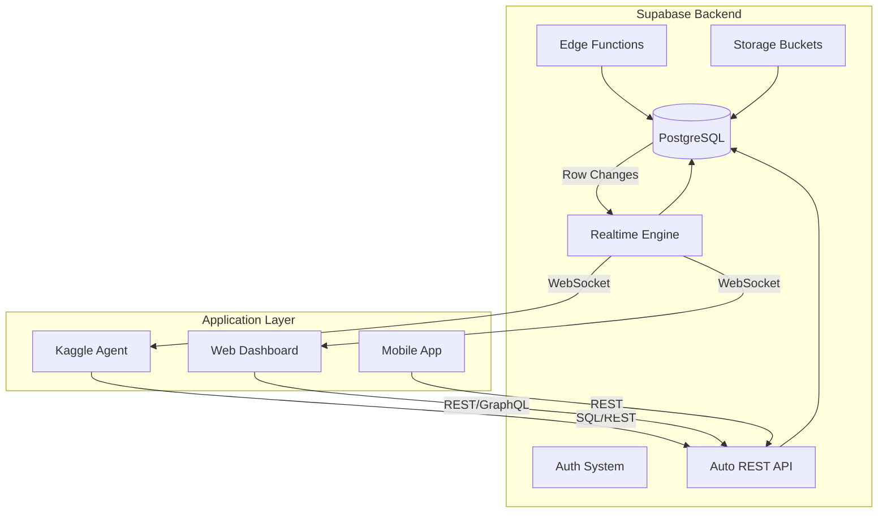

# Kaggle Agent Database Design (Supabase)
**Version**: 0.1  
**Date**: 2025-06-05  
**Database**: Supabase PostgreSQL with Real-time

## 概要

KaggleエージェントシステムのSupabaseデータベース設計。PostgreSQL + リアルタイム機能 + 自動API生成を活用した効率的なデータ管理を実現。

## アーキテクチャ



## コアエンティティ設計

### 1. Competitions (コンペティション管理)

```sql
-- competitions テーブル
CREATE TABLE competitions (
    id UUID DEFAULT gen_random_uuid() PRIMARY KEY,
    kaggle_id TEXT UNIQUE NOT NULL,
    title TEXT NOT NULL,
    description TEXT,
    category TEXT NOT NULL,
    reward INTEGER,
    team_count INTEGER,
    deadline TIMESTAMPTZ NOT NULL,
    evaluation_metric TEXT NOT NULL,
    dataset_size BIGINT,
    
    -- ステータス管理
    status competition_status DEFAULT 'discovered',
    priority competition_priority DEFAULT 'medium',
    
    -- エージェント判断
    feasibility_score DECIMAL(3,2) CHECK (feasibility_score >= 0 AND feasibility_score <= 1),
    estimated_cost DECIMAL(10,2),
    estimated_duration INTERVAL,
    
    -- メタデータ
    created_at TIMESTAMPTZ DEFAULT NOW(),
    updated_at TIMESTAMPTZ DEFAULT NOW(),
    deleted_at TIMESTAMPTZ
);

-- Enum types
CREATE TYPE competition_status AS ENUM (
    'discovered', 'analyzing', 'researching', 'coding', 
    'training', 'submitting', 'completed', 'abandoned'
);

CREATE TYPE competition_priority AS ENUM (
    'low', 'medium', 'high', 'urgent'
);

-- Indexes
CREATE INDEX idx_competitions_status ON competitions(status);
CREATE INDEX idx_competitions_deadline ON competitions(deadline);
CREATE INDEX idx_competitions_priority ON competitions(priority);
```

### 2. Research Results (研究結果管理)

```sql
-- research_sessions テーブル
CREATE TABLE research_sessions (
    id UUID DEFAULT gen_random_uuid() PRIMARY KEY,
    competition_id UUID REFERENCES competitions(id) ON DELETE CASCADE,
    
    query_text TEXT NOT NULL,
    status research_status DEFAULT 'pending',
    
    -- Deep Research結果
    research_plan JSONB,
    findings JSONB,
    citations JSONB,
    audio_summary_url TEXT,
    confidence_score DECIMAL(3,2),
    
    -- 処理時間
    started_at TIMESTAMPTZ DEFAULT NOW(),
    completed_at TIMESTAMPTZ,
    duration_seconds INTEGER,
    
    created_at TIMESTAMPTZ DEFAULT NOW(),
    updated_at TIMESTAMPTZ DEFAULT NOW()
);

CREATE TYPE research_status AS ENUM (
    'pending', 'processing', 'completed', 'failed'
);

-- research_approaches テーブル  
CREATE TABLE research_approaches (
    id UUID DEFAULT gen_random_uuid() PRIMARY KEY,
    research_session_id UUID REFERENCES research_sessions(id) ON DELETE CASCADE,
    
    title TEXT NOT NULL,
    description TEXT,
    approach_type approach_type NOT NULL,
    complexity_level complexity_level NOT NULL,
    
    -- 評価スコア
    relevance_score DECIMAL(3,2),
    innovation_score DECIMAL(3,2),
    feasibility_score DECIMAL(3,2),
    final_rank INTEGER,
    
    -- 実装情報
    required_frameworks TEXT[],
    estimated_training_time INTERVAL,
    estimated_cost DECIMAL(10,2),
    
    created_at TIMESTAMPTZ DEFAULT NOW()
);

CREATE TYPE approach_type AS ENUM (
    'ensemble', 'deep_learning', 'traditional_ml', 'feature_engineering', 'preprocessing'
);

CREATE TYPE complexity_level AS ENUM (
    'baseline', 'intermediate', 'advanced', 'research'
);
```

### 3. Code Generation & Execution

```sql
-- code_generations テーブル
CREATE TABLE code_generations (
    id UUID DEFAULT gen_random_uuid() PRIMARY KEY,
    competition_id UUID REFERENCES competitions(id) ON DELETE CASCADE,
    approach_id UUID REFERENCES research_approaches(id) ON DELETE SET NULL,
    
    -- 生成要求
    task_description TEXT NOT NULL,
    requirements JSONB,
    constraints JSONB,
    target_framework TEXT NOT NULL,
    
    -- 生成結果
    status code_status DEFAULT 'pending',
    generated_code JSONB, -- {main_script, training_script, inference_script, etc.}
    dockerfile TEXT,
    requirements_txt TEXT,
    documentation TEXT,
    
    -- Claude API情報
    claude_model TEXT,
    total_tokens INTEGER,
    cost_usd DECIMAL(10,4),
    
    -- 処理時間
    started_at TIMESTAMPTZ DEFAULT NOW(),
    completed_at TIMESTAMPTZ,
    
    created_at TIMESTAMPTZ DEFAULT NOW(),
    updated_at TIMESTAMPTZ DEFAULT NOW()
);

CREATE TYPE code_status AS ENUM (
    'pending', 'generating', 'completed', 'failed', 'validated'
);

-- training_jobs テーブル
CREATE TABLE training_jobs (
    id UUID DEFAULT gen_random_uuid() PRIMARY KEY,
    competition_id UUID REFERENCES competitions(id) ON DELETE CASCADE,
    code_generation_id UUID REFERENCES code_generations(id) ON DELETE CASCADE,
    
    -- GPU設定
    gpu_type TEXT NOT NULL,
    container_config JSONB,
    environment_vars JSONB,
    
    -- 実行状況
    status training_status DEFAULT 'pending',
    salad_container_group_id TEXT,
    salad_job_id TEXT,
    
    -- リソース使用状況
    started_at TIMESTAMPTZ,
    completed_at TIMESTAMPTZ,
    duration_seconds INTEGER,
    gpu_hours DECIMAL(10,4),
    cost_usd DECIMAL(10,4),
    
    -- 結果
    model_metrics JSONB,
    logs TEXT,
    error_message TEXT,
    
    created_at TIMESTAMPTZ DEFAULT NOW(),
    updated_at TIMESTAMPTZ DEFAULT NOW()
);

CREATE TYPE training_status AS ENUM (
    'pending', 'queued', 'running', 'completed', 'failed', 'cancelled'
);
```

### 4. Submissions & Results

```sql
-- submissions テーブル
CREATE TABLE submissions (
    id UUID DEFAULT gen_random_uuid() PRIMARY KEY,
    competition_id UUID REFERENCES competitions(id) ON DELETE CASCADE,
    training_job_id UUID REFERENCES training_jobs(id) ON DELETE SET NULL,
    
    -- Kaggle submission情報
    kaggle_submission_id TEXT,
    submission_message TEXT,
    
    -- スコア
    public_score DECIMAL(10,6),
    private_score DECIMAL(10,6),
    leaderboard_rank INTEGER,
    
    -- ステータス
    status submission_status DEFAULT 'pending',
    
    -- ファイル情報  
    submission_file_path TEXT, -- Supabase Storage path
    file_size_bytes BIGINT,
    
    submitted_at TIMESTAMPTZ DEFAULT NOW(),
    scored_at TIMESTAMPTZ,
    created_at TIMESTAMPTZ DEFAULT NOW()
);

CREATE TYPE submission_status AS ENUM (
    'pending', 'submitted', 'scored', 'failed'
);
```

### 5. Human Loop Management

```sql
-- human_decisions テーブル
CREATE TABLE human_decisions (
    id UUID DEFAULT gen_random_uuid() PRIMARY KEY,
    competition_id UUID REFERENCES competitions(id) ON DELETE CASCADE,
    
    decision_type decision_type NOT NULL,
    context JSONB NOT NULL,
    options JSONB NOT NULL,
    
    -- 決定結果
    status decision_status DEFAULT 'pending',
    selected_option TEXT,
    human_feedback TEXT,
    
    -- 通知情報
    notification_sent_at TIMESTAMPTZ,
    notification_channels TEXT[], -- ['slack', 'discord', 'email']
    
    -- タイムアウト
    expires_at TIMESTAMPTZ,
    
    created_at TIMESTAMPTZ DEFAULT NOW(),
    decided_at TIMESTAMPTZ,
    updated_at TIMESTAMPTZ DEFAULT NOW()
);

CREATE TYPE decision_type AS ENUM (
    'competition_selection', 'approach_approval', 'budget_approval', 
    'submission_approval', 'error_handling'
);

CREATE TYPE decision_status AS ENUM (
    'pending', 'decided', 'expired', 'cancelled'
);
```

## Supabase特有機能の活用

### 1. Row Level Security (RLS)

```sql
-- Enable RLS
ALTER TABLE competitions ENABLE ROW LEVEL SECURITY;
ALTER TABLE research_sessions ENABLE ROW LEVEL SECURITY;
ALTER TABLE code_generations ENABLE ROW LEVEL SECURITY;
ALTER TABLE training_jobs ENABLE ROW LEVEL SECURITY;
ALTER TABLE submissions ENABLE ROW LEVEL SECURITY;
ALTER TABLE human_decisions ENABLE ROW LEVEL SECURITY;

-- RLS Policies (基本的な読み取り権限)
CREATE POLICY "Enable read access for authenticated users" ON competitions
    FOR SELECT USING (auth.role() = 'authenticated');

CREATE POLICY "Enable read access for authenticated users" ON research_sessions
    FOR SELECT USING (auth.role() = 'authenticated');
```

### 2. Real-time Subscriptions

```sql
-- Real-time subscriptions有効化
ALTER PUBLICATION supabase_realtime ADD TABLE competitions;
ALTER PUBLICATION supabase_realtime ADD TABLE training_jobs;
ALTER PUBLICATION supabase_realtime ADD TABLE submissions;
ALTER PUBLICATION supabase_realtime ADD TABLE human_decisions;
```

### 3. Storage Buckets設定

```sql
-- Storage buckets
INSERT INTO storage.buckets (id, name, public) VALUES 
    ('datasets', 'datasets', false),
    ('models', 'models', false),
    ('submissions', 'submissions', false),
    ('logs', 'logs', false);
```

## インデックス戦略

```sql
-- パフォーマンス最適化用インデックス
CREATE INDEX CONCURRENTLY idx_research_sessions_competition_status 
    ON research_sessions(competition_id, status);

CREATE INDEX CONCURRENTLY idx_training_jobs_status_created 
    ON training_jobs(status, created_at);

CREATE INDEX CONCURRENTLY idx_submissions_competition_score 
    ON submissions(competition_id, public_score DESC NULLS LAST);

CREATE INDEX CONCURRENTLY idx_human_decisions_status_expires 
    ON human_decisions(status, expires_at);

-- JSONB検索用インデックス
CREATE INDEX CONCURRENTLY idx_research_sessions_findings_gin 
    ON research_sessions USING GIN (findings);

CREATE INDEX CONCURRENTLY idx_code_generations_requirements_gin 
    ON code_generations USING GIN (requirements);
```

## 関数・トリガー

```sql
-- updated_at自動更新トリガー
CREATE OR REPLACE FUNCTION update_updated_at_column()
RETURNS TRIGGER AS $$
BEGIN
    NEW.updated_at = NOW();
    RETURN NEW;
END;
$$ language 'plpgsql';

-- 各テーブルにトリガー適用
CREATE TRIGGER update_competitions_updated_at 
    BEFORE UPDATE ON competitions 
    FOR EACH ROW EXECUTE FUNCTION update_updated_at_column();

CREATE TRIGGER update_research_sessions_updated_at 
    BEFORE UPDATE ON research_sessions 
    FOR EACH ROW EXECUTE FUNCTION update_updated_at_column();

-- コスト計算関数
CREATE OR REPLACE FUNCTION calculate_training_cost(
    gpu_hours DECIMAL,
    gpu_type TEXT
) RETURNS DECIMAL AS $$
BEGIN
    RETURN CASE gpu_type
        WHEN 'rtx4090' THEN gpu_hours * 0.15
        WHEN 'a100' THEN gpu_hours * 0.35
        WHEN 'h100' THEN gpu_hours * 0.50
        ELSE gpu_hours * 0.10
    END;
END;
$$ LANGUAGE plpgsql;
```

## データ型定義（TypeScript）

```typescript
// Supabase自動生成型に追加する型定義
export interface Database {
  public: {
    Tables: {
      competitions: {
        Row: Competition;
        Insert: Omit<Competition, 'id' | 'created_at' | 'updated_at'>;
        Update: Partial<Competition>;
      };
      research_sessions: {
        Row: ResearchSession;
        Insert: Omit<ResearchSession, 'id' | 'created_at' | 'updated_at'>;
        Update: Partial<ResearchSession>;
      };
      // ... 他のテーブル
    };
    Functions: {
      calculate_training_cost: {
        Args: { gpu_hours: number; gpu_type: string };
        Returns: number;
      };
    };
  };
}
```

## マイグレーション戦略

### 1. 初期セットアップマイグレーション

```sql
-- 20250605000001_initial_schema.sql
-- ENUMs作成
-- テーブル作成  
-- インデックス作成
-- RLS設定
-- ストレージバケット作成
```

### 2. データ投入マイグレーション

```sql
-- 20250605000002_seed_data.sql
-- 初期競技データ
-- サンプルデータ
```

### 3. バージョン管理

- Supabase CLI使用
- Git管理
- 本番環境での段階的適用

これでSupabaseを活用したデータベース設計が完成です！次は設定管理システム設計に進みますか？ 